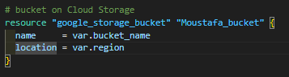
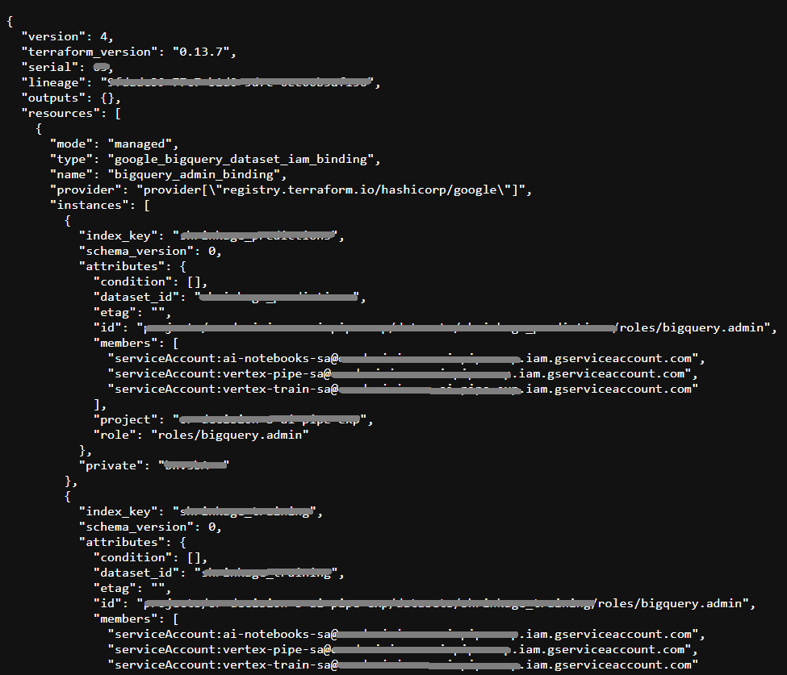
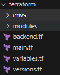
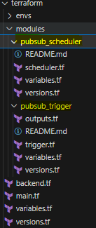
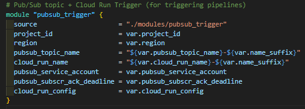
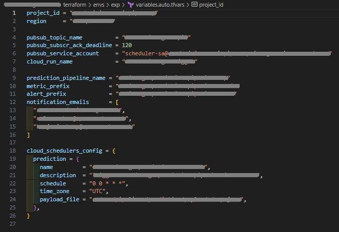
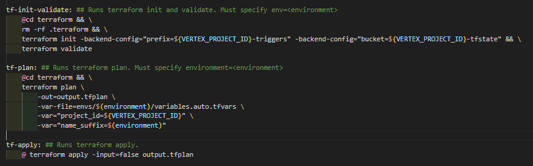

Terraform is an open-source infrastructure as code software tool created by HashiCorp. Users define and provide data center infrastructure using a declarative configuration language known as HashiCorp Configuration.


### What is Terraform? 
* Open-Source Tool: Provides Infrastructure as Code capabilities.
* Functionality: Enables users to define, alter, or remove cloud resources and infrastructure through a declarative language.
* Efficiency: Users only have to define desired resources and configurations. Terraform handles the implementation.

### What is the point of IaC? Why not the UI?
* Version Control: Simplifies tracking modifications and promotes teamwork. Making alterations via the UI makes it challenging to monitor these changes.
* Automation & Reproducibility: Picture deploying a prediction model and having to manually create resources via the UI — tedious and error-prone.

### Anatomy of Terraform Directory
* Before we get into the anatomy, Key Terms to Note:: Resource and State.

##### Resource: 

* Cloud Components you want to create. A bucket is a resource. Same for a Cloud Scheduler, a pub-sub topic or a Vertex AI Notebook. 

*For example*:

In the following picture, you see how a resource being declared in Terraform looks like. 

* In the case of a GCS bucket.
	* The resource type is google_storage_bucket.
	* The resource name is Moustafa_bucket.
	* The resource arguments are the properties of the resource. In this case, the bucket name and the location.



##### State: 
    * When creating resource using Terraform. It keeps track of your infrastructure by creating a state file. This file contains mapping between the resources mapped in your code and the actual resources created in the cloud. 

*For example*:

* In the following picture, you see how a snapshot of a state file looks like.




### Files:
* Main: Where you'd abstractly define the resources.
* Variables: This file declares the input variables used to parameterize the module and allow customization when it's consumed.
* Backend: This file declares the backend configuration for Terraform to store the state file in a remote location.
* Versions: This file declares the version of Terraform to use when running Terraform commands.
* providers: This file declares the provider and its configuration.



### Modularity: 



* To create a module in Terraform, you typically organize a set of related resources into a dedicated directory with the following structure. 
* You can use it in your main Terraform configuration by calling the module and passing values to its input variables.
* You can also use it in other modules by calling it as a child module and passing values to its input variables.
* You can use it as a standalone configuration by calling it from the command line and passing values to its input variables.

Calling a module into main.tf is as simple as:



However different from declaring a resource that is not modularized:


### Environment Variables:
* After all these abstraction, you would need to input the variables that would specify the project, the region or any other variable specific to your case.
* Variable Block within variables.tf
* Command line when applying: terraform apply -var="region=us-west-2"
* Using .tfvars or .json files: terraform apply -var-file="example.tfvars/json"
* There exist a heriarchy of how Terraform reads the variables (In the case of a conflict of variables declared in different places) **The order of precedence is as follows**: 
	1. Command Line -var Flag (Highest Priority): When you provide variable values directly in the command line using the -var flag, these take the highest precedence. This makes sense, as direct user input for a specific run should override any stored configurations ```terraform apply -var "region=us-east-1"```
	
	2. Terraform Configuration Files: The next highest precedence comes from variable definitions in the Terraform configuration files. 
		- Any *.auto.tfvars or *.auto.tfvars.json files, processed in lexical order of their filenames.
		- terraform.tfvars.json file if present.
		- terraform.tfvars file, if present.

	3. Variables declared as a default value with variables.tf file. (Lowest Priority): If no value is set, Terraform uses the default value. If no default value is set, Terraform assigns an empty string ("") to the variable or use default value for the service.




### How to apply your configuration to the cloud?

• This step requires you to have covered 4 elements:

* **The code**: We have that written.
	
* **The cloud project**: Supposing you have that already provisioned for you. 
	
* **The Permission**: The service account. (a service account is a special type of account that is associated with an application, service, or virtual machine rather than an individual user. Service accounts are used to provide authentication and authorization for applications and services to access cloud resources and perform actions only allowed to them based on permissions given to them.)

* **The commands**: 
	- Init
	- Validate
	- Plan
	- Apply
	- Destroy

#### Steps to implement your code to the cloud:

* **Run your commands using a Makefile configuration** to include the permission i.e. Validate your permission using the service account.
* **Init & Validate**: Will initialize the state, nothing to track far. And validate the configurations you have written.
* **Plan**: makes a plan for the changes about to get applied. You might not feel how useful this when creating the resources for the first time. But when modifying resource, it will be useful to see what is being changed or destroyed in your infrastructure.
* **Apply**: Making this plan happen! (-input=false: This flag is used to specify that no interactive input should be expected during the apply process. With this option set to "false," Terraform will not prompt for confirmation or user input for variables or any other interactive features. It assumes all required information is provided through other means, such as using variable definitions, environment variables, or pre-generated execution plans.)



